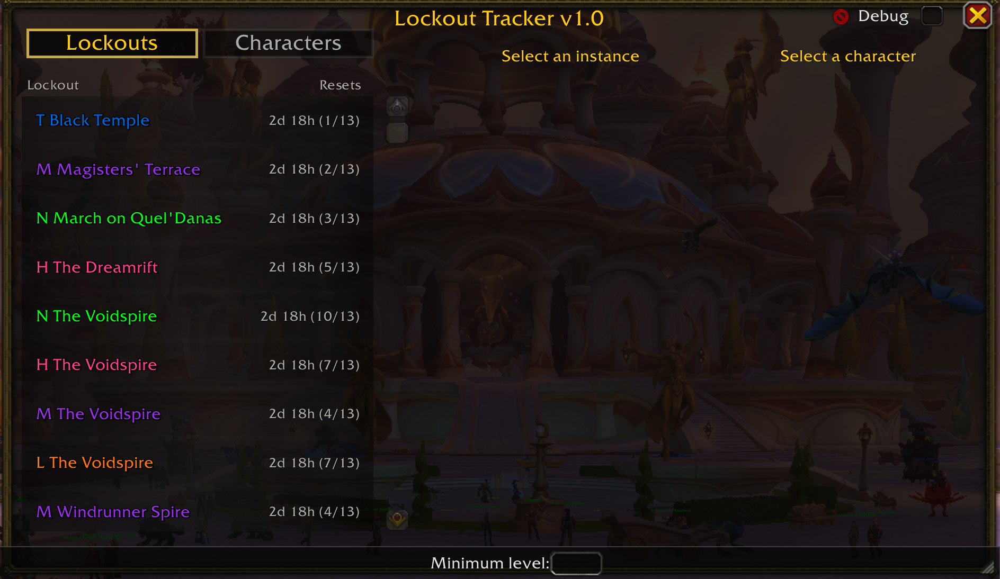
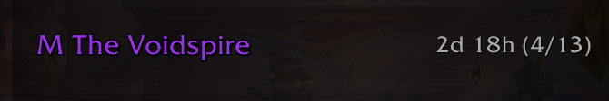
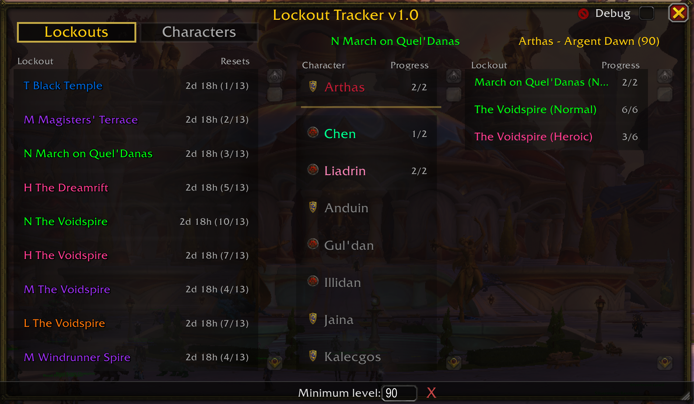
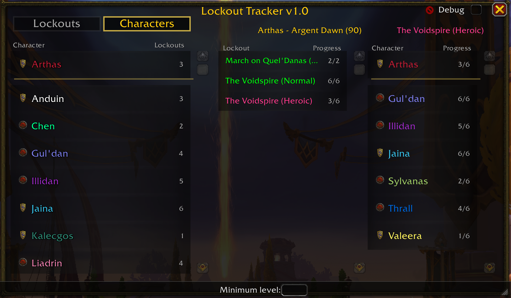

# Lockout Tracker

A World of Warcraft addon for tracking raid and dungeon lockouts (cooldowns) across all your characters.

## 🤖 AI-Generated Addon Warning

**This addon was entirely coded by AI (Claude) and has not been written or reviewed by a human developer.** While the addon has been tested and functions as intended, users should be aware that it was created through an AI-assisted development process. Use at your own discretion.

## Supported WoW Versions

- **11.x** (The War Within)
- **12.x** (Midnight)

## Features

- **View All Characters with Active Cooldowns** - See which characters have active raid/dungeon lockouts at a glance
- **View All Instances with Active Cooldowns** - Browse by instance to see which characters are locked
- **Boss Progress Tracking** - See boss kill progress in "X/Y" format (e.g., "4/7" for Firelands)
- **Dual-Tab Interface**
  - **Lockouts Tab** - Browse by instance to see which characters have lockouts
  - **Characters Tab** - Browse by character to see all their lockouts
- **Current Character Highlighting** - Your active character appears at the top with a golden separator line
- **Class-Colored Names** - Character names display in their class colors
- **Time Until Reset** - Displays time remaining until each lockout expires
- **Level Filter** - Show only characters at or above a minimum level
- **Resizable Window** - Drag the bottom-right corner to scale the window
- **Keybindable** - Assign a hotkey to toggle the window in WoW's keybindings settings

## Screenshots

### Lockouts Tab

Every active lockout across your characters, one row per instance and difficulty. The same raid on several difficulties (here The Voidspire on Normal, Heroic, Mythic and LFR) gets a separate row each. On the right: time until reset and how many of your characters are locked. **Minimum level** at the bottom hides lower-level characters from all lists and counts.

### Lockout Row

- **M** - difficulty letter, colored by difficulty (purple = Mythic)
- **The Voidspire** - instance name
- **2d 18h** - time until the lockout resets
- **(4/13)** - 4 of your 13 characters are locked to it

### Lockouts Tab - Instance Selected

Clicking an instance lists all your characters in the middle column. Locked characters come first in class colors with their boss progress (`2/2`), and the character you're playing is marked with a golden line. Characters free to run it are greyed out. Clicking a character shows all of their lockouts on the right.

### Characters Tab

Your characters with their number of active lockouts, current character on top. Pick a character to see their lockouts with boss progress in the middle, then pick a lockout to see who else is locked to it on the right.

## Reading the Window

Each lockout is colored by difficulty. In the left column the instance name also gets a letter prefix:

| Letter | Difficulty                         | Color  |
| :----: | ---------------------------------- | ------ |
| **L**  | LFR (Raid Finder)                  | Orange |
| **N**  | Normal                             | Green  |
| **H**  | Heroic                             | Pink   |
| **M**  | Mythic (raids and Mythic dungeons) | Purple |
| **T**  | Timewalking                        | Blue   |

Numbers on the right:

- **Lockouts tab, left column** - `2d 18h (3/7)`: time until reset, then how many characters are locked to the instance out of all your characters (respecting the level filter)
- **Characters tab, left column** - number of active lockouts for that character
- **Middle and right columns** - boss progress, e.g. `4/6` bosses killed

## Usage

Install as usual: download `LockoutTracker.zip` from the [latest release](https://github.com/faralaks/wow-lockout-tracker/releases/latest), unpack it and put the `LockoutTracker` folder into `World of Warcraft/_retail_/Interface/AddOns`.

- `/lt` or `/lockouttracker` - Toggle the Lockout Tracker window
- `/lt char` - Print the current character's lockouts to chat
- `/lt reset` - Reset window position and size
- `/lt debug` - Toggle debug mode on/off

You can also bind a key to toggle the window in **ESC > Keybindings > AddOns** (look for **"LockoutTracker Window"**).

## License

[MIT License](LICENSE): free to use, copy, modify, merge, publish, distribute, sublicense and sell, keep the copyright notice, provided as-is, no warranty, authors not liable.

---

Made with ❤️ for World of Warcraft
